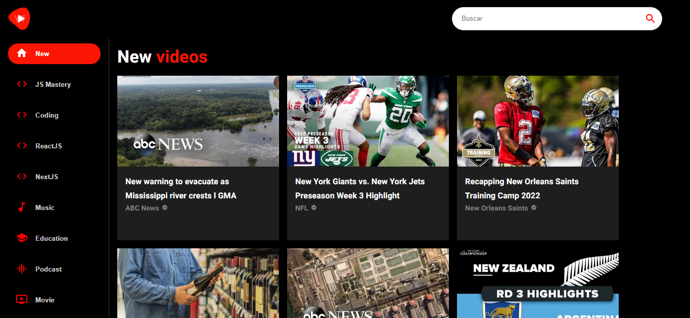
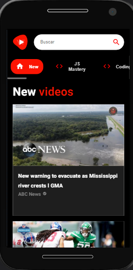

# React Youtube Clone

---

## Descripción

Código Base Del Proyecto React Youtube Clone Hecho En React.js y Material-UI.

---

## Vista En Versión Desktop

## Vista En Versión Mobile

---

## Enlace A La Aplicación

- [React Youtube Clone](https://react-youtube-clone-delta.vercel.app/)

---

## Hecho con

- [React](https://react.dev/) - JS library
- [Material-UI](https://mui.com/) - For Styles

---

## Comandos

- npm i
- npm start
- npm run build

---

## Dependencias

- Axios
- Material-UI
- Rapid-API
- React
- React-Player
- React-Router-Dom
- Youtube-Clone

---

## Autor

- Website - [Axe10rellana](https://axe10rellana.github.io/portafolio/portafolio/)
